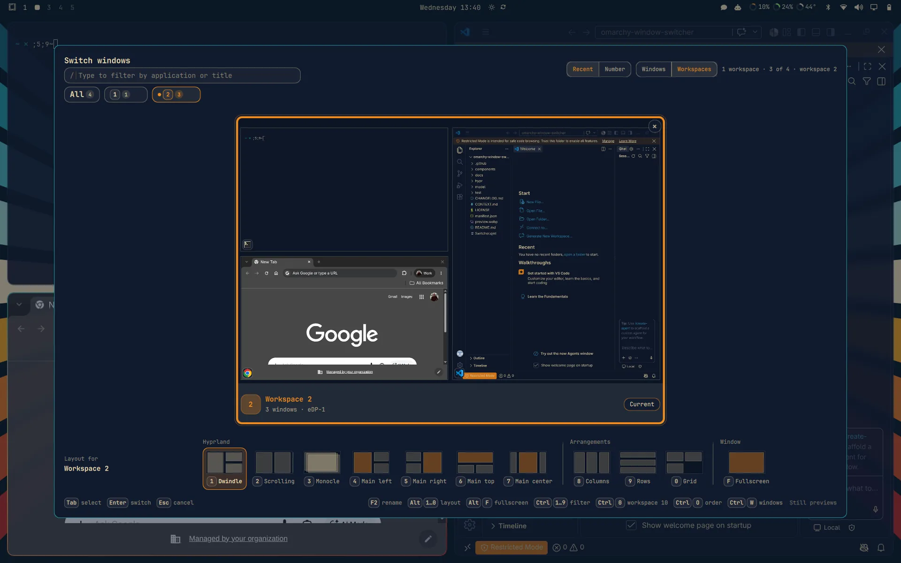
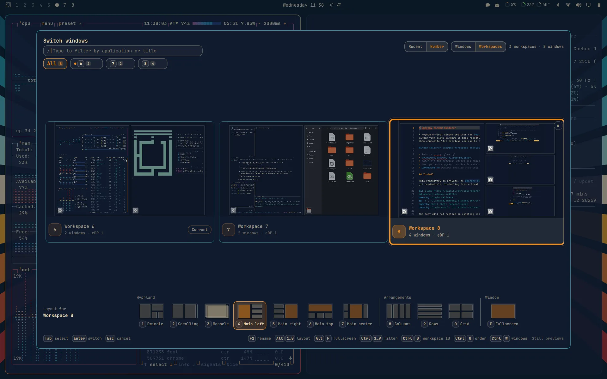

# Omarchy Window Switcher

A keyboard-first window switcher for [Omarchy](https://omarchy.org/). The
window view lists windows in most-recently-used (MRU) order; workspace views
show composite live previews and can be ordered by recent use or by number.



> This is **ctrts' fork** of
> [devmobasa/omarchy-window-switcher](https://github.com/devmobasa/omarchy-window-switcher),
> which did the original design and implementation work. It is MIT licensed and
> the upstream copyright notice is retained in [LICENSE](LICENSE).
> [CHANGELOG.md](CHANGELOG.md) records exactly what this fork changes.

## Install

This repository is private, so `omarchy plugin add` over https will prompt for
git credentials. Installing from a local checkout is the simpler path:

```bash
git clone https://github.com/ctrts/omarchy-window-switcher.git
cd omarchy-window-switcher
omarchy plugin validate .
cp -a . ~/.config/omarchy/plugins/ctr.window-switcher
omarchy shell shell rescanPlugins
omarchy plugin enable ctr.window-switcher
```

The copy will not replace an existing installation — remove the target folder
first if you are reinstalling.

Then add the keybinding to `~/.config/hypr/bindings.lua`:

```lua
o.bind("CTRL + TAB", "Window switcher", "omarchy-shell shell toggle ctr.window-switcher")
```

`CTRL + TAB` is free on a stock Omarchy install — `ALT + TAB` is already
`cycle_next`, `SUPER + TAB` and `SUPER + CTRL + TAB` are workspace navigation,
and `CTRL + ALT + TAB` moves between monitors. No `hl.unbind` is needed.

Reload Hyprland and check for errors:

```bash
hyprctl reload && hyprctl configerrors
```

## Controls

| Input | Action |
|---|---|
| Tab / Shift+Tab | Select the next or previous item |
| Arrow keys | Move through the grid |
| Ctrl+H/J/K/L | Move through the grid with Vim-style keys |
| Type / Backspace | Enter or edit a search query |
| Enter or click | Activate the selected window |
| Click a window inside a workspace preview | Activate that window |
| Escape | Clear the search, then the filter, then close |
| Ctrl+1 … Ctrl+9 | Filter by workspace 1 through 9 |
| Ctrl+0 | Filter by workspace 10 |
| Ctrl+A | Show all windows |
| Ctrl+M | Show or hide minimized windows for this opening |
| Ctrl+O | Switch workspace sections between recent and number order |
| Ctrl+W | Switch between the window and workspace views |
| Ctrl+G | Group the window grid by workspace |
| F2 or right-click a workspace card | Rename that workspace inside the switcher |
| Ctrl+Delete | Close the selected window |
| Middle-click, or the × button | Close a window |
| Middle-click a window inside a workspace preview | Close that window |
| Workspace × button | Close every window on that workspace (needs a second click) |
| Click a layout, or Alt+1 … Alt+0 | Rearrange the selected workspace into that layout |
| Click Fullscreen, or Alt+F | Toggle fullscreen for the selected workspace's most recent window |

Search matches application, title, workspace, monitor, and any local workspace
names you have set. The × in the search box clears the query.

The × button appears on the selected card only, and the pointer selects
whichever card it touches, so the mouse can still reach every one. A click
outside the switcher closes it and restores the window you started from.

Workspace names set here are local to the switcher — they do not rename
Hyprland workspaces or affect any other widget, and they are saved in this
plugin's `shell.json` entry. Clearing a name restores the default `Workspace N`
label; when custom names exist, the workspace header offers a two-click
**Reset names** action.

## Layouts

In the workspace view, a strip under the cards offers ten layouts for the
selected workspace, each drawn with that workspace's window count. Click one,
or press its Alt+digit, and Hyprland rearranges the workspace. The switcher
stays open so the card shows the result; Enter or Escape carries on as usual.

| Key | Layout | Kind |
|---|---|---|
| Alt+1 | Dwindle | Hyprland |
| Alt+2 | Scrolling | Hyprland |
| Alt+3 | Monocle | Hyprland |
| Alt+4 … Alt+7 | Main left, right, top, center (master) | Hyprland |
| Alt+8 | Columns | Arrangement |
| Alt+9 | Rows | Arrangement |
| Alt+0 | Grid | Arrangement |
| Alt+F | Fullscreen | Window |



Fullscreen is a toggle on the workspace's most recent window — the one Enter
switches to — rather than a saved layout. It is marked while that workspace has
a fullscreen window.

Arrangements are real tiling layouts registered through Hyprland's Lua layout
API by [`hypr/layouts.lua`](hypr/layouts.lua), so windows opened later still
fall into the shape. Nothing needs to be added to `~/.config/hypr`.

The choice is saved to `~/.local/state/omarchy/workspace-layouts/<id>.lua`,
the same file Omarchy's own SUPER+L layout toggle writes, so a config reload
restores whichever of the two ran last. Delete that file to go back to the
default layout after the next reload. If the plugin is removed, a saved
arrangement falls back to Hyprland's default layout.

Requires Hyprland 0.56 or newer with the Lua config.

## Configuration

Configuration lives in this plugin's entry in `~/.config/omarchy/shell.json`,
which is the canonical shell configuration and is not deep-merged.

The defaults are workspace cards, recent workspace order, and still previews.
You can change the view, order, filter, capture, and activation — every key,
invocation payload, and limit is documented in the
[configuration reference](docs/configuration.md).

## Requirements

- Omarchy with the schema-version-1 shell plugin host (tested against 4.0.3)
- Quickshell 0.3.0 or newer with `ToplevelManager` and `ScreencopyView`
- Hyprland with `zwlr-foreign-toplevel-management-v1`
- `hyprland-toplevel-export-v1` for previews — switching works without it

The plugin is QML and JavaScript, plus one Lua module that runs inside
Hyprland when you pick a layout. It starts no processes, polls no `hyprctl`,
builds no shell commands from window metadata, and writes no preview images to
disk. See [design and privacy](docs/design.md).

## Troubleshooting

### The switcher does not open

```bash
omarchy plugin list --json | jq '.[] | select(.id == "ctr.window-switcher")'
omarchy shell shell ping
omarchy shell shell call ctr.window-switcher status ""
omarchy shell shell rescanPlugins
```

Confirm the plugin is enabled and present in `shell.json`. Remove private
window titles before sharing any of that output.

### Cards show icons instead of previews

The compositor, or that particular window, is not offering capture access.
Switching, search and activation still work. Set `previewMode` to `none` to
turn capture off entirely.

### A window is missing

Press Ctrl+A or pick the All pill — the header count shows how many windows the
current filter is hiding. If it is still absent, collect `hyprctl clients -j`
and the Wayland app id, with private titles removed.

## Development

Run the test suite from the repository root:

```bash
./test/all
```

It runs the Node model tests, the source contract tests, the Lua layout module
against a stand-in `hl` table (when `lua` is installed), `omarchy plugin
validate`, and `qmllint`. The script locates `qmllint` even when it is not on
PATH (Arch ships it in `/usr/lib/qt6/bin`) and builds a temporary `qs/` module
tree so the shell's `qs.Commons` and `qs.Ui` imports actually resolve — without
that, lint silently type-checks nothing and the gate proves nothing.

Three qmllint categories are disabled deliberately, because each is a
Quickshell structural limit rather than a defect here: `missing-property`
(Color and Style expose surfaces as inline anonymous `QtObject`s that qmllint
cannot introspect), `unresolved-type` (Quickshell returns types without
declarative registration), and `uncreatable-type` (`PanelWindow` is created by
the runtime).

CI runs the model tests only; the other gates need the Omarchy shell source,
the `omarchy` CLI, and Qt, none of which exist on a stock runner.

For release validation, install into a disposable Omarchy VM and exercise
native Wayland, XWayland, Electron, modal, fullscreen, minimized and special
workspace windows, plus preview failure and mixed-scale multi-monitor layouts.

## Credits

Original design and implementation by
[devmobasa](https://github.com/devmobasa). Their
[Omarchy plugin collection](https://github.com/devmobasa#omarchy-plugins)
is worth reading in full — it includes
[Window Overview](https://github.com/devmobasa/omarchy-window-overview),
[Scratchpad Deck](https://github.com/devmobasa/omarchy-scratchpad-deck),
[Minimizer Tray](https://github.com/devmobasa/omarchy-minimizer-tray),
[Monitor Layout](https://github.com/devmobasa/omarchy-monitor-layout) and
[Wallpaper Hub](https://github.com/devmobasa/omarchy-wallpaper-hub) for
desktop and window management, alongside productivity, automation and
system plugins.

## License

MIT. This project is a clean-room Omarchy integration based on public APIs and
observed behavior. It does not copy GPL switcher implementations.
